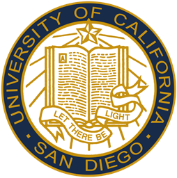
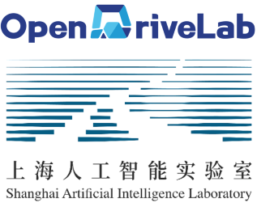
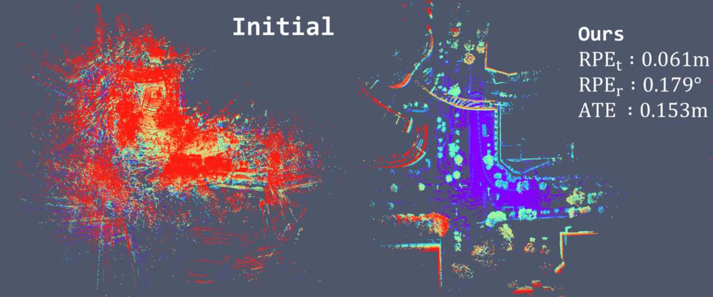
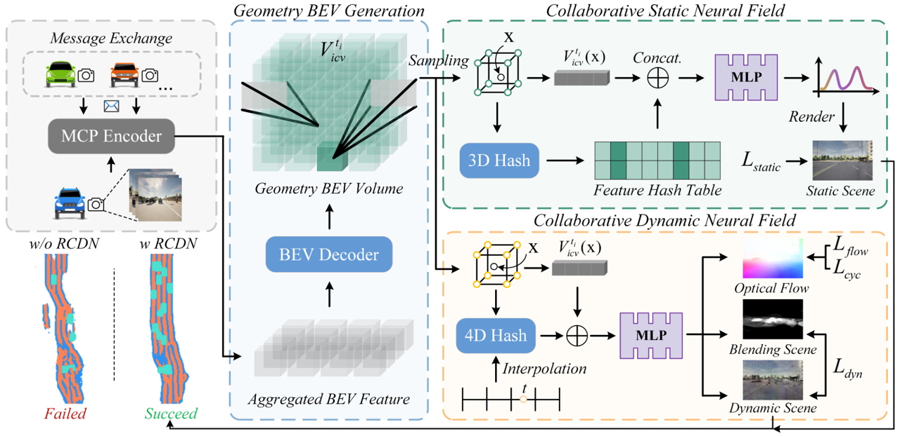
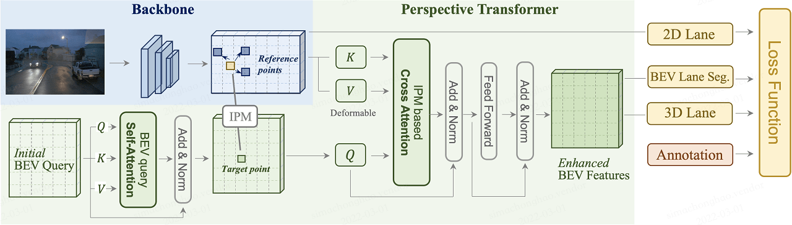

## 💫About Me

I am currently a second-year M.S.E. student at [ISPC Lab](https://embodiment.ai/) of [Tongji University](https://www.tongji.edu.cn/) and advised by [Prof. Guang Chen](https://scholar.google.com/citations?user=kBhIyv4AAAAJ&hl=en&oi=sra). Before this, I obtained the bachelor’s degree in Vehicle Engineering at Tongji University.

My research interests mainly focus on 3D Computer Vision, including Dynamic Reconstruction, Generative Models and Autonomous Driving. In 2022, I was a research intern at [OpenDriveLab](https://opendrivelab.com/) of [Shanghai AI Laboratory](https://www.shlab.org.cn/) advised by [Prof. Hongyang Li](https://scholar.google.com/citations?user=Hfrih1EAAAAJ&hl=en). From 2024, I interned at [CCVL](https://ccvl.jhu.edu/) Lab of [Johns Hopkins University](https://www.jhu.edu/) advised by Bloomberg Distinguished Professor [Alan L. Yuille](https://scholar.google.com/citations?user=FJ-huxgAAAAJ&hl=en). And I have been a visiting student at [SU Lab](https://cseweb.ucsd.edu/~haosu/) of [UC San Diego](https://ucsd.edu/) advised by [Prof. Hao Su](https://scholar.google.com/citations?user=1P8Zu04AAAAJ&hl=en), where I spent a wonderful time in La Jolla.

Now I'm looking for **Ph.D. (Fall 2025)** opportunities, please feel free to drop me an [email](mailto:zhengzehan@tongji.edu.cn)📬!  

Download my [Curriculum Vitae](../files/CV_ZehanZheng.pdf).
  

 
&nbsp; &nbsp; &nbsp; 
 
&nbsp; &nbsp; &nbsp; 
 
&nbsp; &nbsp; &nbsp; &nbsp; &nbsp; &nbsp; 
 

<!-- &nbsp;   -->
  
## 🔥News
**[2024/12]** Invited Talk at Princeton University. [[slides]](../files/Talk_princeton_zehan.pdf)   
**[2024/12]** Invited as a Reviewer for ICML.  
**[2024/09]** 🎉 Two papers was accepted by **NeurIPS 2024**.  
**[2024/08]** Invited as a Reviewer for ICLR.  
**[2024/05]** Invited as a Reviewer for NeurIPS.  
**[2024/02]** 🎉 One paper was accepted by **CVPR 2024**.  
**[2024/01]** Invited as a Reviewer for ECCV.  
**[2023/11]** Invited as a Reviewer for CVPR.  
**[2023/05]** Invited as a Reviewer for ICCV.  
**[2023/02]** 🎉 One paper was accepted by **CVPR 2023**.  
**[2022/07]** 🎉 One paper was accepted by **ECCV 2022 (Oral, top 2.7%)**.
  
  
&nbsp;  

## 📝Publications

**LiDAR4D: Dynamic Neural Fields for Novel Space-time View LiDAR Synthesis**   
**Zehan Zheng**, Fan Lu, Weiyi Xue, Guang Chen, Changjun Jiang.   
**CVPR**, 2024  
**[[Paper]](https://arxiv.org/abs/2404.02742) &#124; [[Code]](https://github.com/ispc-lab/LiDAR4D) &#124; [[Project Page]](https://dyfcalid.github.io/LiDAR4D) &#124; [[Video]](https://www.youtube.com/watch?v=E6XyG3A3EZ8) &#124; [[Talk]](https://www.bilibili.com/video/BV1Uy411Y766/?t=10870) &#124; [[Slides]](https://drive.google.com/file/d/1Q6yTVGoBf_nfWR4rW9RcSGlxRMufmSXc/view?usp=sharing) &#124; [[Poster]](https://drive.google.com/file/d/13cf0rSjCjGRyBsYOcQSa6Qf1Oe1a5QCy/view?usp=sharing)**   
Differentiable LiDAR-only framework for novel space-time LiDAR view synthesis, which reconstructs dynamic driving scenarios and generates realistic LiDAR point clouds end-to-end. It also supports simulation in the dynamic scene.  

<video autoplay loop muted playsinline width="25%">
  <source src="..\static\videos\NeuralPCI\webm\DHB_demo_1.webm" type="video/webm" />
  <source src="..\static\videos\NeuralPCI\DHB_demo_1.mp4" type="video/mp4">
</video>&nbsp;
<video autoplay loop muted playsinline width="72%">
  <source src="..\static\videos\NeuralPCI\webm\NL_Drive_demo.webm" type="video/webm" />
  <source src="..\static\videos\NeuralPCI\NL_Drive_demo.mp4" type="video/mp4">
</video>

**NeuralPCI: Spatio-temporal Neural Field for 3D Point Cloud Multi-frame Non-linear Interpolation**  
**Zehan Zheng**∗, Danni Wu∗, Ruisi Lu, Fan Lu, Guang Chen, Changjun Jiang  
**CVPR**, 2023  
**[[Paper]](https://arxiv.org/abs/2303.15126)** &#124; **[[Code]](https://github.com/ispc-lab/NeuralPCI)** &#124; **[[Project Page]](https://dyfcalid.github.io/NeuralPCI)**  | **[[Video]](https://www.youtube.com/watch?v=KXPkEwBGzOI)** (6min)| **[[Talk]](https://www.bilibili.com/video/BV1Ch4y1x75q?t=27896)** (15min) | **[[Slides]](https://drive.google.com/file/d/141G0mk4XubM4HFSyyXsCWZBuzXQ9PGO0/view?usp=sharing)** | **[[Poster]](https://drive.google.com/file/d/1sahMOrG32hRhqSxqoreW65U1DcSKCvgm/view?usp=sharing)**  
4D spatio-temporal Neural field for 3D Point Cloud Interpolation, which implicitly integrates multi-frame information to handle nonlinear large motions for both indoor and outdoor scenarios.  

**GeoNLF: Geometry-guided Pose-Free Neural LiDAR Fields**   
Weiyi Xue∗, <b>Zehan Zheng</b>∗, Fan Lu, Haiyun Wei, Guang Chen, Changjun Jiang   
**NeurIPS**, 2024  
**[[Paper]](https://openreview.net/pdf/b3ec2fcef289fdc0a522265263e68abbbc1b50ff.pdf) &#124; [[Poster]](https://neurips.cc/media/PosterPDFs/NeurIPS%202024/93231.png?t=1733402073.7734404)**  
Global neural optimization framework for pose-free LiDAR reconstruction, which provides explicit geometric priors and achieve simultaneous large-scale multi-view registration and novel view synthesis.  

**RCDN: Towards Robust Camera Insensitivity Collaborative Perception via Dynamic Feature-based 3D Neural Modeling**   
Tianhang Wang, Fan Lu, **Zehan Zheng**, Guang Chen, Changjun Jiang    
**NeurIPS**, 2024  
**[[Paper]](https://openreview.net/pdf/77f2d832456b7a6eb754fdba89e8ffddfcc6ed91.pdf) &#124; [[Slides]](https://neurips.cc/media/neurips-2024/Slides/93052.pdf) &#124; [[Poster]](https://neurips.cc/media/PosterPDFs/NeurIPS%202024/93052.png?t=1731389969.1951804)**    
Collaborative perception framework with BEV feature based static and dynamic fields, which can recover failed perceptual messages sent by multiple agents and achieve high collaborative performance with low calibration cost.  

  

  
**PersFormer: 3D Lane Detection via Perspective Transformer and the OpenLane Benchmark**  
Li Chen∗, Chonghao Sima∗, Yang Li∗, **Zehan Zheng**, Jiajie Xu, Xiangwei Geng, Hongyang Li, Conghui He, Jianping Shi, Yu Qiao, Junchi Yan.  
**ECCV**, 2022 (Oral)  
**[[Paper]](https://arxiv.org/abs/2203.11089)** &#124; **[[Code]](https://github.com/OpenDriveLab/PersFormer_3DLane)** &#124; **[[Blog]](https://zhuanlan.zhihu.com/p/552908337)** &#124; **[[Slides]](https://docs.google.com/presentation/d/1on8TmXQSXo0n-dI9voRUe5j8YNg2CfcmoP7esK0GuXI/edit?usp=sharing)** &#124; **[[Video]](https://www.youtube.com/watch?v=JJ84ttN4hBY)** (4min) &#124; **[[Talk]](https://app6ca5octe2206.pc.xiaoe-tech.com/p/t_pc/course_pc_detail/video/v_63311e31e4b0c942649a9314)** (50min) &#124; **[[Poster]](https://drive.google.com/file/d/1aCc3yJkfjSSmtdXIicG4cov2f1EalbSX/view?usp=sharing)**  
End-to-end monocular 3D lane detector with a novel Transformer-based spatial feature transformation module which generates BEV features by attending to related front-view local regions with camera parameters as a reference. 

&nbsp;  
  
## 🏗️Projects

<video autoplay loop muted playsinline width="100%" >
  <source src="../images/bev_demo.mp4" type="video/mp4">
</video>

  
**Vehicle-mounted Surround-view Fisheye Camera Panoramic Bird's Eye View (BEV) Calibration**  

**[[GitHub Demo]](https://github.com/dyfcalid/CameraCalibration)**    
A novel calibration method for vehicle-mounted surround fish-eye cameras based on the drone, and a real-time bird’s eye view (BEV) generator.  

&nbsp;  
  

## 💻Research Experience

- July 2024 - Present  
  ***Research Intern*** - **[SU Lab](https://cseweb.ucsd.edu/~haosu/), University of California San Diego**  
  Advisor: [Prof. Hao Su](https://scholar.google.com/citations?user=1P8Zu04AAAAJ&hl=en)  
  Research included: 3D Scene Generation, 3D Diffusion  

- March 2024 - Present  
  ***Research Intern*** - **Computational Cognition, Vision, and Learning Lab ([CCVL](https://ccvl.jhu.edu/)), Johns Hopkins University**  
  Advisor: [Prof. Alan L. Yuille](https://scholar.google.com/citations?user=FJ-huxgAAAAJ&hl=en)   
  Research included: Gaussian Splatting from Sparse Point Clouds  

- July 2022 - Present  
  ***Research Assistant*** - **Intelligent Sensing, Perception and Computing Lab ([ISPC](https://ispc-group.github.io/)), Tongji University**  
  Advisor: [Prof. Guang Chen](https://scholar.google.com/citations?user=kBhIyv4AAAAJ)  
  Research included: 3D Point Clouds, 4D Reconstruction, Neural Fields  

- Dec. 2021 - June 2022  
  ***Research Intern*** - **[OpenDriveLab](https://opendrivelab.com/) of Shanghai AI Laboratory**  
  Advisor: [Prof. Hongyang Li](https://scholar.google.com/citations?user=Hfrih1EAAAAJ)  
  Research included: 3D Laneline Detection in Autonomous Driving  

- Mar. 2021 - Nov. 2021    
  ***Research Intern*** - **Comprehensive Perception Research Group ([CPRG](https://github.com/tjiiv-cprg)), Tongji University**  
  Advisor: [Prof. Wei Tian](https://scholar.google.com/citations?user=aYKQn88AAAAJ)  
  Research included: Fish-eye Camera Calibration, Bird’s Eye View (BEV)  
  

&nbsp;   

## 🛠️Engineering Experience
- 2018 - 2021  
**Tongji University (Formula SAE) [Racing Team](http://www.tjuracing.com/) sponsored by Lotus** 🏎️  
Technical Leader & Driver & Aerodynamics Group  
Achieve 1st in FSC-2019 / 3rd in FSJ-2019 / 3rd in FSC-2020 / 2nd in FSC-2021  
Best Aerodynamics Award in FSJ 2019, Best Design Report Award in FSC 2020  

&nbsp;   

## 🏆Honors and Awards
- NeurIPS Scholar Award (Travel Grant), 2024
- Excellent Graduate of Tongji University, 2022
- Outstanding Student of Tongji University, 2018, 2021, 2023
- First Prize of Tongji University Scholarship (Top 2%), 2018, 2021, 2023
- National First Prize in Formula Student China Competition (FSC), 2020
- National Second Prize of China Undergraduate Mathematical Contest in Modeling (CUMCM), 2020  

&nbsp;  
